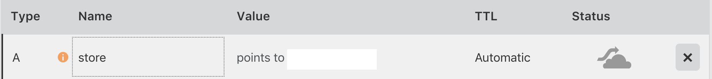

# Lightning Charge API example

**API charge Flow**

1. Invoice sent to BTCPayServer
1. redirect / callback urls back to app
1. store order result in db
1. do the things

**Prerequisites:**

1. [btcpayserver](https://github.com/btcpayserver/btcpayserver)
    - 1. domain name (this app will register subdomain store.example.com) 
1. docker
1. docker-compose


**How to Use**

1. install btcpayserver
1. in btcpayserver run `docker network ls` and save BTCPAY_NETWORK 
1. Clone this repository:
1. Make a copy of our .env.sample and rename it to .env:
Update this file with your preferences.
1. register A name with dns
  
```

APP_PORT=<4321>
APP_SECRET=<>
NODE_ENV=development
MONGO_INITDB_ROOT_USERNAME=un
VIRTUAL_HOST=store.example.com
LETSENCRYPT_HOST=store.example.com
MONGO_CONTAINER_NAME=db
MONGO_INITDB_ROOT_PASSWORD=pw
MONGO_URI=mongodb://un:pw@db/admin
BTCPAY_HOST=<BTCPAYSERVER>
BTCPAY_STORE_ID=<>
CALLBACK_HOST=<>
DB_NAME=<>
LETSENCRYPT_EMAIL=<>
BTCPAY_NETWORK=<>

```

 run 

`bash run.sh`

 stop 

`bash stop.sh`

restart

`bash restart.sh`
